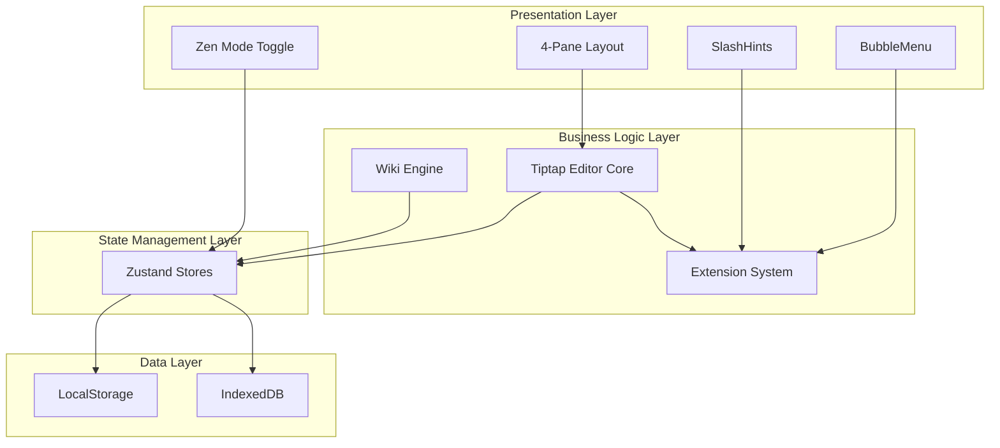
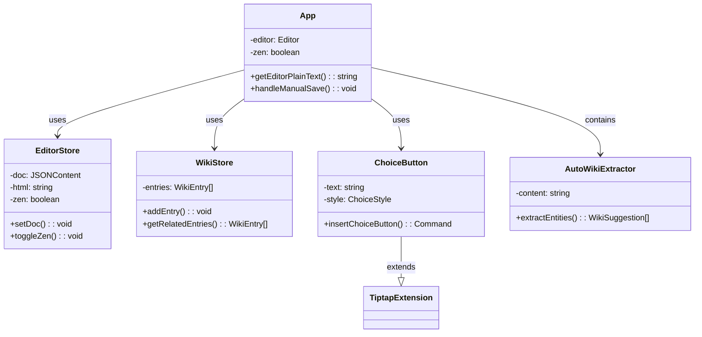
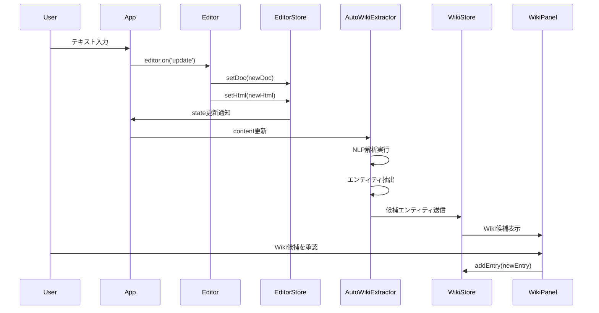

# Narrative Generation Editor Page

Wiki-Based Story Database System with Tiptap Editor

## 概要

物語創作支援のための包括的エディタシステム。Wikiベースの物語世界データベースと高機能エディタを統合し、没入感のある創作体験を提供します。

## アーキテクチャ

### システム構成図



### コンポーネント関係図



### システムアーキテクチャ


## 主要機能

### ✨ エディタ機能
- **4ペインレイアウト**: Scene/Editor/Preview/Wiki の統合表示
- **Zenモード**: 集中執筆モード（`Ctrl+Shift+Z`）
- **区切り機能**: 5種類のスタイル（線、星、点、波、画像）
- **選択肢機能**: 4種類のスタイル（通常、重要、危険、控えめ）
- **リアルタイムプレビュー**: JSON→React変換

### 🔍 Wiki機能
- **自動Wiki抽出**: 日本語NLPによる人名、場所、アイテム、組織の自動抽出
- **タグベース関連項目表示**: エントリ間の関連性を自動表示
- **エディタ連携**: テキスト選択からWikiリンク生成

### 📝 没入感投稿システム
- キャラクター執筆、ルーモア、名言、日記、手紙、ニュースの6種類

## セットアップ

```bash
cd editor-proto
npm install
npm run dev
```

http://localhost:5173 にアクセス

## キーバインド

| キー | 機能 |
|------|------|
| `Ctrl+Shift+Z` | Zenモード切替 |
| `Ctrl+Shift+C` | 選択肢ボタン挿入 |
| `Ctrl+S` | 手動保存 |

## 技術スタック

- **フレームワーク**: React 18 + TypeScript
- **ビルドツール**: Vite
- **エディタ**: Tiptap (ProseMirror)
- **状態管理**: Zustand
- **スタイリング**: CSS Modules + CSS Variables

## プロジェクト構造

```
src/
├── components/          # UIコンポーネント
│   ├── ZenIndicator.tsx # Zenモード切替
│   ├── Preview.tsx      # プレビューパネル
│   ├── ScenePanel.tsx   # シーンパネル
│   ├── WikiPanel.tsx    # Wikiパネル
│   └── ...
├── extensions/          # Tiptapエクステンション
│   ├── choiceButton.ts  # 選択肢機能
│   ├── divider.ts       # 区切り機能
│   └── ...
├── store/              # 状態管理（Zustand）
│   ├── useEditorStore.ts
│   ├── useSceneStore.ts
│   └── useWikiStore.ts
├── styles/             # CSSモジュール
│   ├── base.css        # 基本スタイル
│   ├── editor.css      # エディタ
│   ├── components.css  # コンポーネント
│   ├── extensions.css  # エクステンション
│   ├── wiki.css        # Wikiパネル
│   └── scenes.css      # シーンパネル
└── App.tsx             # メインアプリ
```

## 操作フロー

### エディタ操作とWiki自動抽出



## ドキュメント

- [API ドキュメント](./docs/API_DOCUMENTATION.md)
- [アーキテクチャ概要](./docs/ARCHITECTURE_OVERVIEW.md)
- [UML ダイアグラム](./docs/UML_README.md)
- [DoxyGen ガイド](./docs/README_DOXYGEN.md)
- [開発計画](./docs/DEVELOPMENT_PLAN.md)

## ライセンス

MIT License
