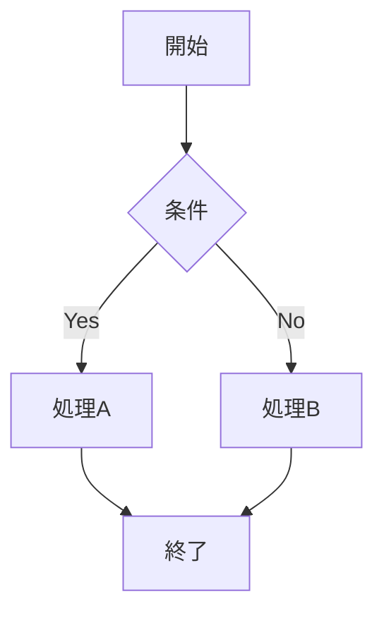
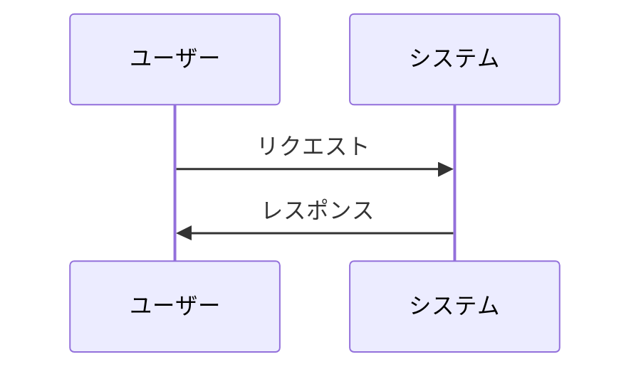
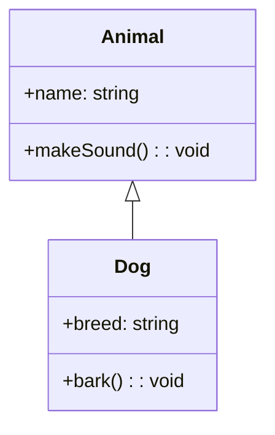

# Mermaid ダイアグラム ガイド

## 概要

このプロジェクトではMermaidを使用してシステムの構造と動作を視覚的に表現しています。MermaidはGitHubで直接表示される軽量なダイアグラム記法です。

## ダイアグラム一覧

### 1. システムアーキテクチャ (`system-architecture.md`)
- **目的**: システム全体のレイヤー構造を表現
- **形式**: Graph TB (Top-Bottom)
- **内容**: プレゼンテーション層、ビジネスロジック層、状態管理層、データ層、スタイリング層

### 2. コンポーネントフロー (`component-flow.md`)
- **目的**: データフローと処理シーケンスを表現
- **形式**: Flowchart + Sequence Diagram + State Diagram
- **内容**: 
  - データフロー図
  - Wiki自動抽出フロー
  - 選択肢機能フロー

### 3. ユーザージャーニー (`user-journey.md`)
- **目的**: ユーザー体験とシステムとの相互作用を表現
- **形式**: Journey Diagram
- **内容**:
  - 物語創作ジャーニー
  - Wiki自動抽出体験

### 4. クラス関係図 (`class-relationships.md`)
- **目的**: コンポーネント間の関係と状態管理を表現
- **形式**: Class Diagram + Graph LR
- **内容**:
  - コンポーネント関係
  - 状態管理フロー

## Mermaid の表示方法

### GitHub上での表示
GitHubは自動的にMermaidダイアグラムをレンダリングします：
1. `.md`ファイル内の```mermaidブロックが自動表示
2. README.mdで直接確認可能

### VSCode拡張機能
1. **Mermaid Preview** 拡張機能をインストール
2. `.md`ファイルを開く
3. `Ctrl+Shift+P` → "Mermaid: Preview"

### オンライン表示
1. [Mermaid Live Editor](https://mermaid.live/) にアクセス
2. Mermaidコードをコピー&ペースト
3. リアルタイムプレビュー

## Mermaidの利点

### PlantUMLとの比較
| 特徴 | Mermaid | PlantUML |
|------|---------|----------|
| GitHub表示 | ✅ ネイティブ対応 | ❌ 外部サービス必要 |
| 記法 | シンプル | 詳細・複雑 |
| 図の種類 | 豊富 | 非常に豊富 |
| 学習コスト | 低い | 中程度 |

### 使い分け
- **Mermaid**: README表示、簡潔な図、GitHub連携
- **PlantUML**: 詳細な設計図、複雑な関係、印刷用

## 図の更新

システムに変更を加えた際は、対応するMermaidダイアグラムも更新してください：

1. **新しいコンポーネント追加** → クラス関係図を更新
2. **新しいフロー** → コンポーネントフローを更新
3. **ユーザー体験変更** → ユーザージャーニーを更新
4. **アーキテクチャ変更** → システムアーキテクチャを更新

## 記法例

### 基本的なフローチャート


### シーケンス図


### クラス図

