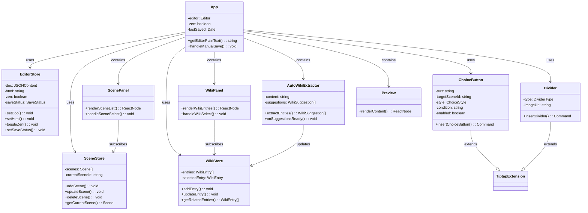
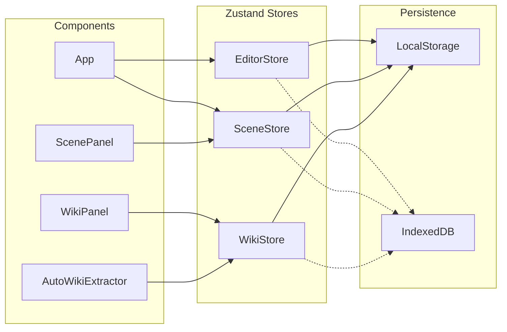

# クラス関係図 (Mermaid)

## コンポーネント関係

```mermaid
classDiagram
    class App {
        -editor: Editor
        -zen: boolean
        -lastSaved: Date
        +getEditorPlainText(): string
        +handleManualSave(): void
    }
    
    class EditorStore {
        -doc: JSONContent
        -html: string
        -zen: boolean
        -saveStatus: SaveStatus
        +setDoc(): void
        +setHtml(): void
        +toggleZen(): void
        +setSaveStatus(): void
    }
    
    class SceneStore {
        -scenes: Scene[]
        -currentSceneId: string
        +addScene(): void
        +updateScene(): void
        +deleteScene(): void
        +getCurrentScene(): Scene
    }
    
    class WikiStore {
        -entries: WikiEntry[]
        -selectedEntry: WikiEntry
        +addEntry(): void
        +updateEntry(): void
        +getRelatedEntries(): WikiEntry[]
    }
    
    class ChoiceButton {
        -text: string
        -targetSceneId: string
        -style: ChoiceStyle
        -condition: string
        -enabled: boolean
        +insertChoiceButton(): Command
    }
    
    class Divider {
        -type: DividerType
        -imageUrl: string
        +insertDivider(): Command
    }
    
    class AutoWikiExtractor {
        -content: string
        -suggestions: WikiSuggestion[]
        +extractEntities(): WikiSuggestion[]
        +onSuggestionsReady(): void
    }
    
    class WikiPanel {
        +renderWikiEntries(): ReactNode
        +handleWikiSelect(): void
    }
    
    class ScenePanel {
        +renderSceneList(): ReactNode
        +handleSceneSelect(): void
    }
    
    class Preview {
        +renderContent(): ReactNode
    }
    
    App --> EditorStore : uses
    App --> SceneStore : uses
    App --> WikiStore : uses
    App --> ChoiceButton : uses
    App --> Divider : uses
    App --> AutoWikiExtractor : contains
    App --> WikiPanel : contains
    App --> ScenePanel : contains
    App --> Preview : contains
    
    WikiPanel --> WikiStore : subscribes
    ScenePanel --> SceneStore : subscribes
    AutoWikiExtractor --> WikiStore : updates
    
    ChoiceButton --|> TiptapExtension : extends
    Divider --|> TiptapExtension : extends
```

## 状態管理フロー

```mermaid
graph LR
    subgraph "Zustand Stores"
        A[EditorStore]
        B[SceneStore]
        C[WikiStore]
    end
    
    subgraph "Components"
        D[App]
        E[WikiPanel]
        F[ScenePanel]
        G[AutoWikiExtractor]
    end
    
    subgraph "Persistence"
        H[LocalStorage]
        I[IndexedDB]
    end
    
    D --> A
    D --> B
    E --> C
    F --> B
    G --> C
    
    A --> H
    B --> H
    C --> H
    
    A -.-> I
    B -.-> I
    C -.-> I
```
