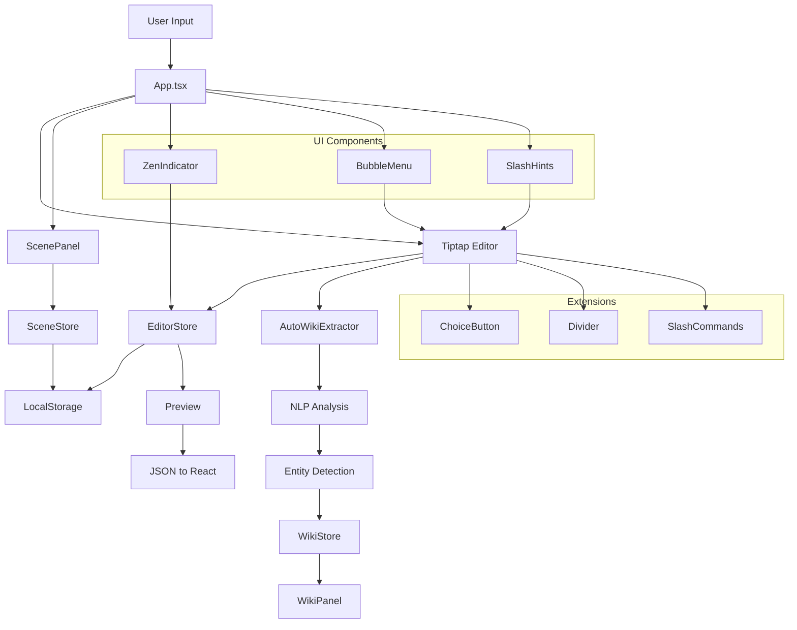
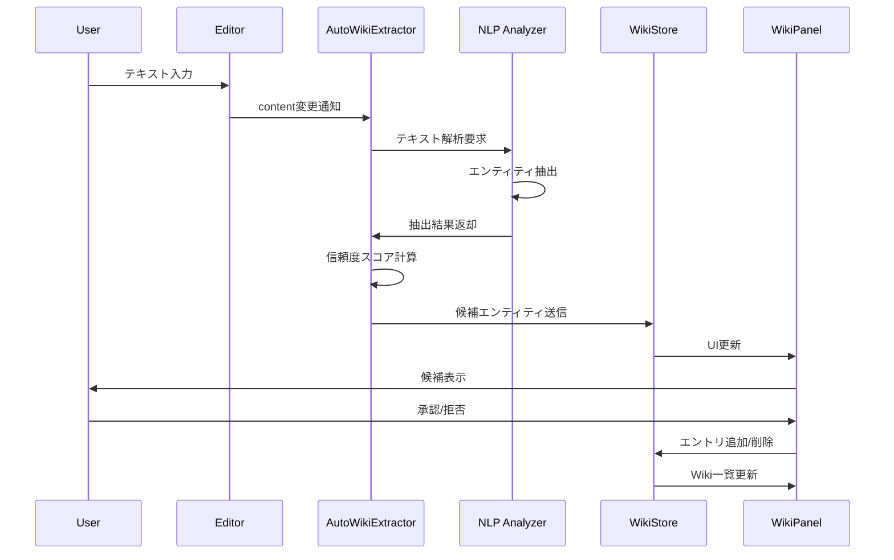
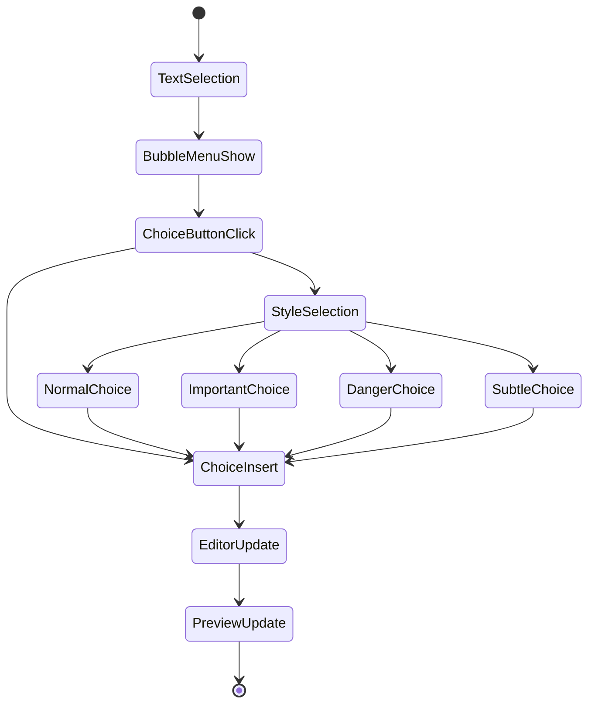

# コンポーネントフロー (Mermaid)

## データフロー図

```mermaid
flowchart TD
    A[User Input] --> B[App.tsx]
    B --> C[Tiptap Editor]
    C --> D[EditorStore]
    D --> E[LocalStorage]
    
    C --> F[AutoWikiExtractor]
    F --> G[NLP Analysis]
    G --> H[Entity Detection]
    H --> I[WikiStore]
    I --> J[WikiPanel]
    
    B --> K[ScenePanel]
    K --> L[SceneStore]
    L --> E
    
    D --> M[Preview]
    M --> N[JSON to React]
    
    subgraph "Extensions"
        O[ChoiceButton]
        P[Divider]
        Q[SlashCommands]
    end
    
    C --> O
    C --> P
    C --> Q
    
    subgraph "UI Components"
        R[ZenIndicator]
        S[BubbleMenu]
        T[SlashHints]
    end
    
    B --> R
    B --> S
    B --> T
    
    R --> D
    S --> C
    T --> C
```

## Wiki自動抽出フロー

```mermaid
sequenceDiagram
    participant U as User
    participant E as Editor
    participant AWE as AutoWikiExtractor
    participant NLP as NLP Analyzer
    participant WS as WikiStore
    participant WP as WikiPanel

    U->>E: テキスト入力
    E->>AWE: content変更通知
    AWE->>NLP: テキスト解析要求
    NLP->>NLP: エンティティ抽出
    NLP->>AWE: 抽出結果返却
    AWE->>AWE: 信頼度スコア計算
    AWE->>WS: 候補エンティティ送信
    WS->>WP: UI更新
    WP->>U: 候補表示
    U->>WP: 承認/拒否
    WP->>WS: エントリ追加/削除
    WS->>WP: Wiki一覧更新
```

## 選択肢機能フロー

```mermaid
stateDiagram-v2
    [*] --> TextSelection
    TextSelection --> BubbleMenuShow
    BubbleMenuShow --> ChoiceButtonClick
    ChoiceButtonClick --> ChoiceInsert
    ChoiceInsert --> EditorUpdate
    EditorUpdate --> PreviewUpdate
    PreviewUpdate --> [*]
    
    ChoiceButtonClick --> StyleSelection
    StyleSelection --> NormalChoice
    StyleSelection --> ImportantChoice
    StyleSelection --> DangerChoice
    StyleSelection --> SubtleChoice
    
    NormalChoice --> ChoiceInsert
    ImportantChoice --> ChoiceInsert
    DangerChoice --> ChoiceInsert
    SubtleChoice --> ChoiceInsert
```
