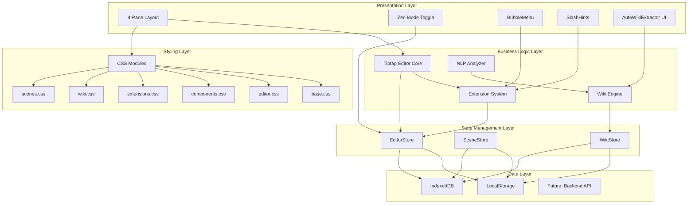

# システムアーキテクチャ (Mermaid)

## レイヤーアーキテクチャ

```mermaid
graph TB
    subgraph "Presentation Layer"
        A[4-Pane Layout]
        B[Zen Mode Toggle]
        C[BubbleMenu]
        D[SlashHints]
        E[AutoWikiExtractor UI]
    end
    
    subgraph "Business Logic Layer"
        F[Tiptap Editor Core]
        G[Extension System]
        H[Wiki Engine]
        I[NLP Analyzer]
    end
    
    subgraph "State Management Layer"
        J[EditorStore]
        K[SceneStore]
        L[WikiStore]
    end
    
    subgraph "Data Layer"
        M[LocalStorage]
        N[IndexedDB]
        O[Future: Backend API]
    end
    
    subgraph "Styling Layer"
        P[CSS Modules]
        Q[base.css]
        R[editor.css]
        S[components.css]
        T[extensions.css]
        U[wiki.css]
        V[scenes.css]
    end
    
    A --> F
    B --> J
    C --> G
    D --> G
    E --> H
    F --> G
    F --> J
    G --> J
    H --> L
    I --> H
    J --> M
    K --> M
    L --> M
    J --> N
    K --> N
    L --> N
    A --> P
    P --> Q
    P --> R
    P --> S
    P --> T
    P --> U
    P --> V
```
