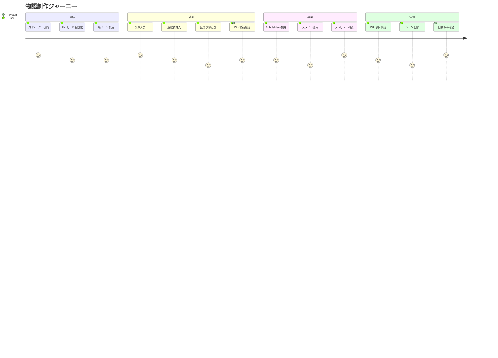
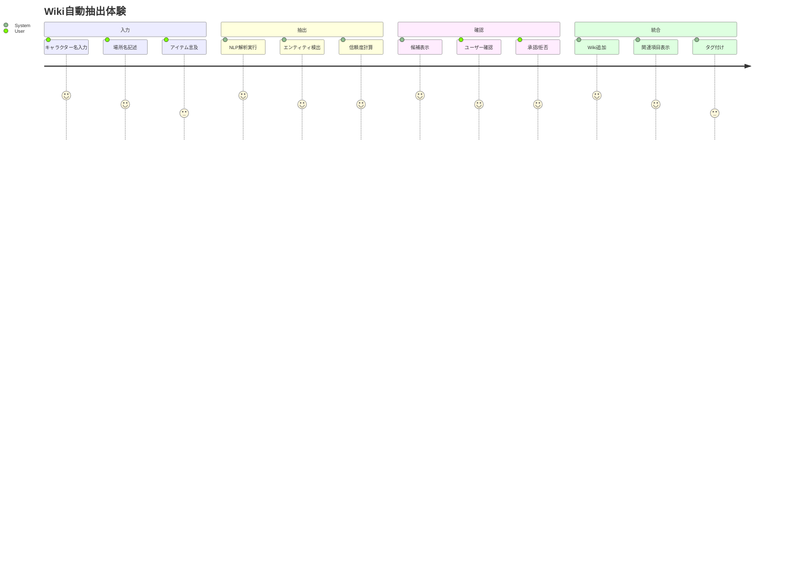

# ユーザージャーニー (Mermaid)

## 創作フロー

```mermaid
journey
    title 物語創作ジャーニー
    section 準備
      プロジェクト開始: 5: User
      Zenモード有効化: 4: User
      新シーン作成: 4: User
    section 執筆
      文章入力: 5: User
      選択肢挿入: 4: User
      区切り線追加: 3: User
      Wiki候補確認: 4: User, System
    section 編集
      BubbleMenu使用: 4: User
      スタイル適用: 3: User
      プレビュー確認: 5: User
    section 管理
      Wiki項目承認: 4: User
      シーン切替: 3: User
      自動保存確認: 5: System
```

## Wiki自動抽出体験

```mermaid
journey
    title Wiki自動抽出体験
    section 入力
      キャラクター名入力: 5: User
      場所名記述: 4: User
      アイテム言及: 3: User
    section 抽出
      NLP解析実行: 5: System
      エンティティ検出: 4: System
      信頼度計算: 4: System
    section 確認
      候補表示: 5: System
      ユーザー確認: 4: User
      承認/拒否: 4: User
    section 統合
      Wiki追加: 5: System
      関連項目表示: 4: System
      タグ付け: 3: System
```
